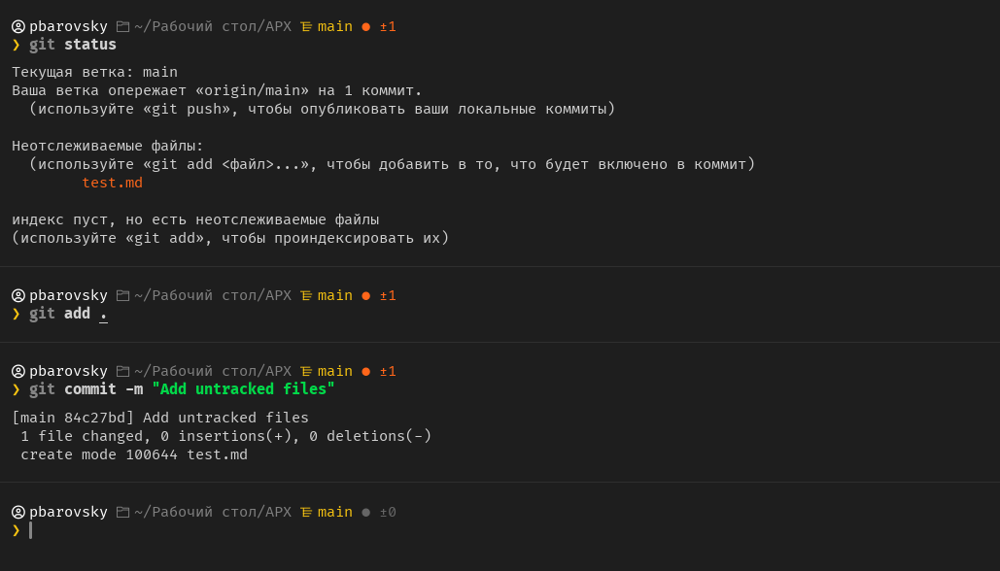

# pbdevflow - a custom zsh theme

**pbdevflow** — это минималистичная, но информативная кастомная тема для Oh My Zsh, идеально подходящая для разработчиков. 

Тема оформлена и оптимизирована для работы с [Nerd Fonts](https://www.nerdfonts.com/) (рекомендуемый шрифт — **Fira Code Nerd Font**), что позволяет использовать иконки для удобного отображения статуса репозитория и других элементов.



## Основные возможности
- **Путь** — показывает текущий путь.
- **Имя пользователя** — отображает текущего пользователя.
- **Интеграция с Git** — показывает активную ветку и статус репозитория:
  - 🟠 **Есть изменения** ( + количество измененных файлов)
  - ⚫ **Чистый репозиторий**
- **Иконки** — используются Nerd Fonts для отображения информации.

## Установка

1. Склонируйте репозиторий
```sh
git clone https://github.com/pbarovsky/pbdevflow.git
```
2. Положите файл .zsg-theme в папку ~/.oh-my-zsh/custom/themes

3. Откройте файл `~/.zshrc` и смените тему
```sh
ZSH_THEME="pbdevflow"
```

4. Примените изменения
```
source ~/.zshrc
```

## Лицензия
pbdevflow распространяется по лицензии **MIT**.

